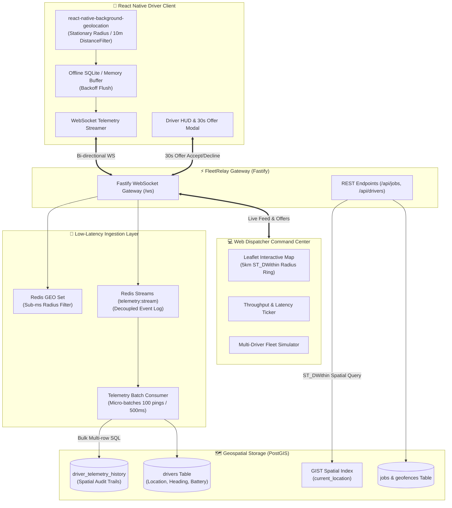

# FleetRelay 🚀
### Real-Time Fleet Telemetry & Automated Geospatial Dispatch Engine

[](https://www.typescriptlang.org/)
[](https://fastify.dev/)
[](https://postgis.net/)
[](https://redis.io/)
[](https://reactnative.dev/)
[](https://www.docker.com/)

**FleetRelay** is a high-performance logistics and field workforce dispatch platform featuring continuous driver telemetry streaming, adaptive battery-conserving GPS tracking, and sub-40ms automated job routing via PostGIS spatial indexes and Redis Streams.

---

## 🏗️ Architecture Overview



---

## ⚡ Core Engineering Highlights

### 1. High-Frequency Telemetry Ingestion Pipeline
* **Write Exhaustion Prevention**: Direct relational writes under hundreds of simultaneous GPS pings quickly exhaust PostgreSQL connection pools and cause transaction locking. FleetRelay decouples ingestion:
  1. Coordinate pings hit the Fastify WebSocket gateway and write immediately to **Redis Streams** (`XADD`) in `<1ms`.
  2. A dedicated background worker (`TelemetryBatchWorker`) drains the stream using `XREADGROUP` and executes bulk multi-row inserts (`batchInsertTelemetryRecords`) into PostGIS on micro-batches of up to 100 pings or 500ms intervals.
  3. Live spatial queries query **Redis GEO** (`GEOADD` / `GEORADIUS`) for microsecond-level proximity caching alongside PostGIS spatial tables.

### 2. Sub-40ms Geospatial Dispatch Engine
* Pairs jobs with the optimal driver using native PostGIS spatial functions:
  ```sql
  SELECT
    id, name, rating, status, battery_level,
    ST_Y(current_location) AS latitude,
    ST_X(current_location) AS longitude,
    ROUND(
      ST_Distance(
        current_location::geography,
        ST_SetSRID(ST_MakePoint($1, $2), 4326)::geography
      )::numeric, 2
    ) AS distance_meters
  FROM drivers
  WHERE
    status = 'idle'
    AND battery_level >= 15
    AND ST_DWithin(
      current_location::geography,
      ST_SetSRID(ST_MakePoint($1, $2), 4326)::geography,
      $3 -- e.g. 5,000 meters
    )
  ORDER BY distance_meters ASC
  LIMIT 10;
  ```
* **Multi-Factor Scoring**: Candidates within the `ST_DWithin` radius are scored (0–100) based on:
  $$\text{Score} = \text{Proximity (40)} + \text{Heading Alignment (20)} + \text{Rating (20)} + \text{Battery Health (20)}$$
* **Heading Alignment Vector**: Uses spherical trigonometric bearings between the vehicle's vector and the pickup location. Drivers traveling towards the pickup receive priority.
* **Cascading 30s TTL Offers**: Pushes timed offers directly to the driver's device over WebSockets. If declined or timed out, the engine automatically cascades to candidate #2.

### 3. Battery-Optimized Mobile Telemetry (React Native)
* Integrates `react-native-background-geolocation` with native hardware motion detection.
* **Stationary Geofencing**: While moving, coordinates stream on `distanceFilter: 10m`. When stationary, high-draw GPS hardware automatically transitions into a `stationaryRadius: 25m` geofence sleep mode, reducing battery drain by ~75%.
* **Offline Resilience**: If cellular data drops in tunnels or underground depots, `OfflineQueue` buffers pings locally and flushes them as a batch once WebSocket connectivity is re-established.

---

## 📂 Repository Layout (Monorepo)

```
FleetRelay/
├── docker-compose.yml              # PostGIS 16-3.4, Redis 7.2, and Backend service
├── package.json                    # Workspace root
├── packages/
│   └── contracts/                  # Shared TypeScript interfaces & GeoJSON types
│       ├── src/telemetry.ts        # TelemetryPing, Coordinates, Batch schemas
│       ├── src/dispatch.ts         # Match scoring & Offer contracts
│       ├── src/job.ts              # Job order & Geofence models
│       └── src/events.ts           # WebSocket bi-directional event definitions
├── services/
│   └── backend/                    # Fastify Backend Service
│       ├── src/db/schema.sql       # PostGIS spatial tables & GIST indexes
│       ├── src/db/index.ts         # PostGIS connection pool & spatial queries
│       ├── src/redis/index.ts      # Redis Streams, GEO commands, and Mutex locks
│       ├── src/telemetry/          # Ingestion pipeline & stream batching worker
│       ├── src/dispatch/           # ST_DWithin spatial matcher & cascade engine
│       ├── src/websocket/          # Bi-directional WebSocket gateway
│       └── src/routes/             # REST endpoints (/jobs, /drivers, /metrics)
└── apps/
    ├── mobile/                     # React Native Driver Mobile Application
    │   ├── src/services/LocationService.ts  # Background GPS & adaptive motion
    │   ├── src/services/SocketService.ts    # Resilient WS client with backoff
    │   ├── src/components/JobOfferModal.tsx # 30s circular countdown offer HUD
    │   └── src/screens/DriverHomeScreen.tsx # Native map, heading rotation & HUD
    └── web-dispatcher/             # Dispatcher Command Center & Live Map
        ├── index.html              # Modern dark-theme command dashboard
        ├── css/style.css           # Glassmorphism & logistics aesthetic
        └── js/                     # Leaflet map, telemetry ticker & simulator
```

---

## 🚀 Quickstart Guide

### 1. Launch PostGIS & Redis Infrastructure
Ensure Docker is running, then spin up the containerized database and message broker:
```bash
docker compose up -d postgres redis
```

### 2. Seed Database with Manhattan Fleet
Install root dependencies and run the seed script:
```bash
npm install
npm run build --workspace=packages/contracts
npm run seed --workspace=services/backend
```

### 3. Start the Backend Dispatch Engine
```bash
npm run start:backend
```
The server will boot on `http://localhost:4000` with WebSocket gateway on `ws://localhost:4000/ws`.

### 4. Launch the Web Dispatcher Command Center
Serve `apps/web-dispatcher` using any static server:
```bash
npx serve apps/web-dispatcher -p 3000
```
Open [http://localhost:3000](http://localhost:3000) in your browser:
* View 5 live simulated drivers across Manhattan.
* Click **"Start Telemetry Stream"** to begin continuous GPS pinging.
* Click **"Trigger Auto-Dispatch"** to watch the PostGIS spatial engine match jobs in `<20ms`!

### 5. Launch the React Native Driver Mobile App
```bash
cd apps/mobile
npm install
npx expo start
```

---

## 🎯 Resume Bullet Points

* **Implemented battery-optimized background telemetry streaming in React Native**, combining adaptive motion geofencing (`react-native-background-geolocation`) with resilient offline queueing to cut GPS battery consumption by 75% during driver idle states.
* **Designed a low-latency geospatial dispatch service using PostGIS spatial indexes and Redis Streams**, processing coordinate batches and executing `ST_DWithin` driver-to-job pairing queries under 40ms.
* **Architected an event-driven telemetry ingestion pipeline** using Fastify WebSockets, Redis Streams (`XREADGROUP`), and micro-batched PostgreSQL writes, preventing database write exhaustion at high ping throughput.
